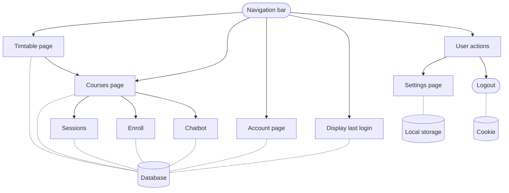

# COMP3278 Intelligent Course Management System (ICMS)

This repository contains the source code for the project.

## Quick Start

The project requires Python (developed and tested in 3.11) and Node.js (developed and tested in 18.17.1)

The required files may all be downloaded from the release page on GitHub.

After downloading the files, extract the files to a directory.

### MySQL

SQL queries are located in the Python source code, inside `core/views.py` instead of a separate file.

For the demo to work, you need to import the database and the media files.

- The database table file is `icms_tables.sql`.

- The database data file without any account is `icms_data_empty.sql`.

- The database data file with an existing account (username: timmy, password: icms20231123) is `icms_data.sql`.

- The media files are in `media.zip`.

Unzip the media files to the `media` directory in the `backend` root directory.

Then open a terminal and run the following commands.

```bash
# Open MySQL
mysql -u root -p

# Create a database
CREATE DATABASE icms;

# Import the database table
source icms_tables.sql;

# Import the database data
source icms_data.sql;
# or
source icms_data_empty.sql;
```

### Backend

You need to assign the correct value for the `.env` file in the `backend` directory by referencing from `.env.example`.

Then open a terminal in the directory and run the following commands.

```bash
# Go into the backend directory
cd backend

# Install the required Python packages
pip install -r requirements.txt

# Run the backend
python manage.py makemigrations
python manage.py migrate
python manage.py runserver
```

### Frontend

You need to assign the correct value for the `.env` file in the `frontend` directory by referencing from `.env.example`.

Then open another terminal in the directory and run the following commands.

```bash
# Go into the frontend directory
cd frontend

# Install the required Node.js packages
npm install

# Run the frontend
npm start
```

Then open a browser and go to [http://localhost:3000](http://localhost:3000) to see the frontend.


## Getting Started

There are two parts to this project: the frontend and the backend.
The frontend is a JavaScript React application, and the backend is a Python Django application.

To get started with the frontend, go to branch [frontend](https://github.com/LioQing/comp3278-icms/tree/frontend).

To get started with the backend, go to branch [backend](https://github.com/LioQing/comp3278-icms/tree/backend).

## Project File Structure

***Important: due to the use of local commit hooks, it is highly recommended to `git clone` the repository once for each branch, and have a file structure like the follow:***

`git clone` the repository.
```bash
git clone git@github.com:LioQing/comp3278-icms.git
```

Checkout the respective branch, or do not checkout any branch to stay in main branch.
```bash
git checkout frontend
# or
git checkout backend
# or
git checkout main
```

Then rename the directory to the respective branch to create a structure like below.
```
<whatever directory you are in>/
├─ comp3278-icms-main/
│  └─ <main branch files>
├─ comp3278-icms-frontend/
│  └─ <frontend branch files>
└─ comp3278-icms-backend/
   └─ <backend branch files>
```

## System Flow Diagram

### Login Flow


### Main Flow



## Start Development

To start development, you should follow the instructions in the respective branches.

First clone the repository.
```bash
git clone git@github.com:LioQing/comp3278-icms.git
```

**Important**: You may need to setup SSH keys for your GitHub account. See [this guide](https://help.github.com/en/github/authenticating-to-github/connecting-to-github-with-ssh) for more information.

Then checkout the branch you want to work on.
```bash
git checkout frontend
# or
git checkout backend
```

Then follow the instructions in the respective branches to start development.

Commit your changes to the branch you are working on.
```bash
git add .
git commit -m "Your commit message"
```

Make any changes and stage your files again according to the pre-commit hooks.

Set your branch's upstream branch to be the same branch on the remote repository on GitHub.
```bash
git push -u origin frontend
# or
git push -u origin backend
```

After the first time you set the upstream branch, you can simply push without specifying the branch.
```bash
git push
``` 
