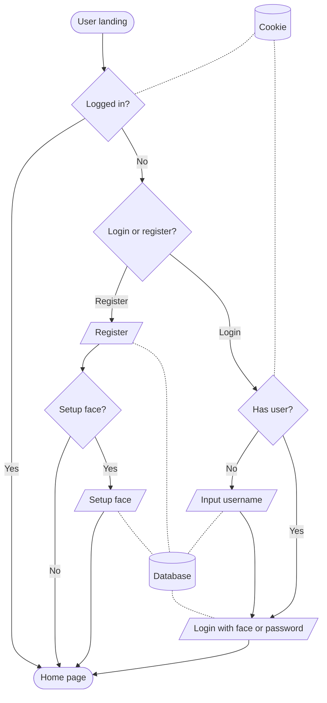
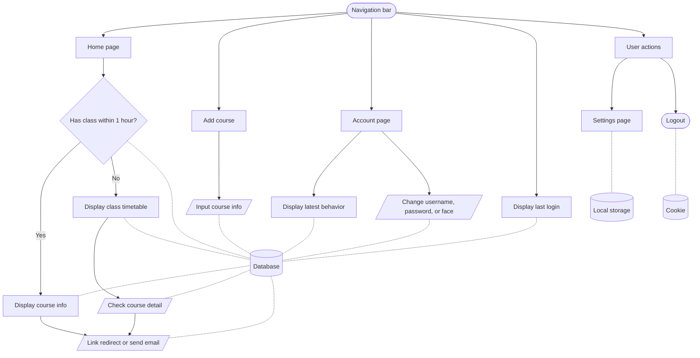

# COMP3278 Intelligent Course Management System (ICMS)

This repository contains the source code for the project.

## Getting Started

There are two parts to this project: the frontend and the backend.
The frontend is a JavaScript React application, and the backend is a Python Django application.

To get started with the frontend, go to branch [frontend](https://github.com/LioQing/comp3278-icms/tree/frontend).

To get started with the backend, go to branch [backend](https://github.com/LioQing/comp3278-icms/tree/backend).

## Project File Structure

***Important: due to the use of local commit hooks, it is highly recommended to `git clone` the repository once for each branch, and have a file structure like the follow:***

`git clone` the repository.
```bash
git clone git@github.com:LioQing/comp3278-icms.git
```

Checkout the respective branch, or do not checkout any branch to stay in main branch.
```bash
git checkout frontend
# or
git checkout backend
# or
git checkout main
```

Then rename the directory to the respective branch to create a structure like below.
```
<whatever directory you are in>/
├─ comp3278-icms-main/
│  └─ <main branch files>
├─ comp3278-icms-frontend/
│  └─ <frontend branch files>
└─ comp3278-icms-backend/
   └─ <backend branch files>
```

## System Flow Diagram

### Login Flow



### Main Flow



## Start Development

To start development, you should follow the instructions in the respective branches.

First clone the repository.
```bash
git clone git@github.com:LioQing/comp3278-icms.git
```

**Important**: You may need to setup SSH keys for your GitHub account. See [this guide](https://help.github.com/en/github/authenticating-to-github/connecting-to-github-with-ssh) for more information.

Then checkout the branch you want to work on.
```bash
git checkout frontend
# or
git checkout backend
```

Then follow the instructions in the respective branches to start development.

Commit your changes to the branch you are working on.
```bash
git add .
git commit -m "Your commit message"
```

Make any changes and stage your files again according to the pre-commit hooks.

Set your branch's upstream branch to be the same branch on the remote repository on GitHub.
```bash
git push -u origin frontend
# or
git push -u origin backend
```

After the first time you set the upstream branch, you can simply push without specifying the branch.
```bash
git push
``` 
